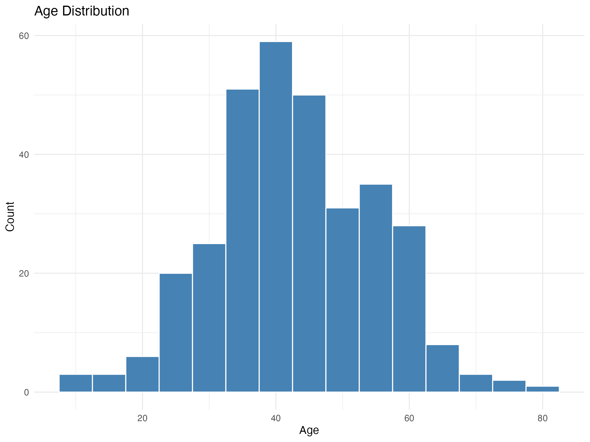
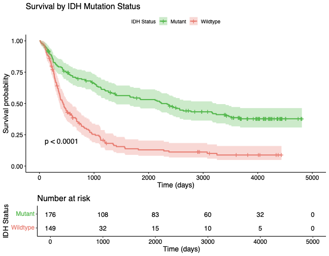
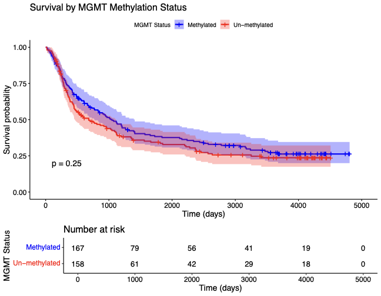
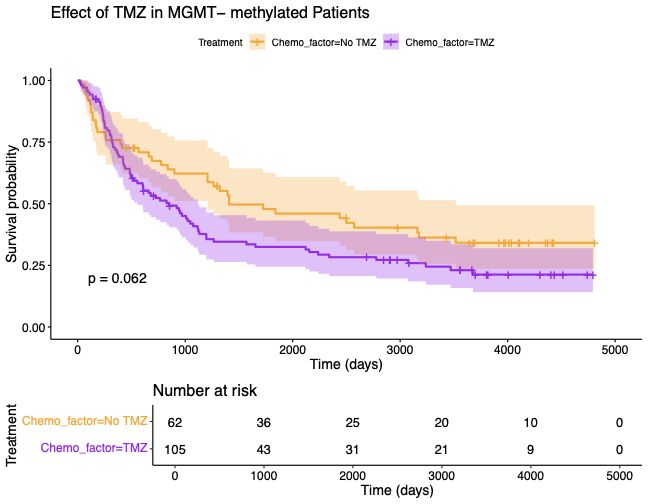
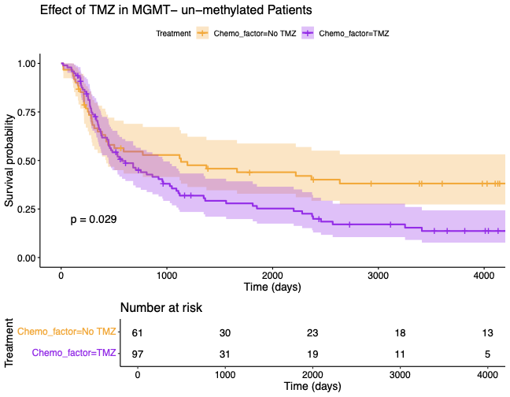

```{r setup, include=FALSE}
knitr::opts_chunk$set(echo = FALSE, message = FALSE, warning = FALSE)
# This document is pre-rendered. The code below is for context.
# source("R/utils.R")
# load_required_packages(c("ggplot2", "readxl", "dplyr", "survival"))
```

# Abstract

We analyzed a single-center adult glioma cohort using a transparent, script-driven workflow. This report synthesizes the results into a cohesive biological and clinical narrative. We demonstrate that survival is powerfully stratified by the established molecular markers of IDH mutation and MGMT promoter methylation. The combination of these markers provides a risk stratification superior to either alone. We confirm that the survival benefit associated with temozolomide is most pronounced in MGMT-methylated tumors, aligning with its known predictive role. We distill these multivariable findings into a simple, point-based prognostic score that effectively separates patients into low, medium, and high-risk groups. Finally, we show that these clinical and molecular strata correspond to distinct transcriptional programs, including the proneural-mesenchymal axis, providing a biological basis for the observed outcomes. This whitepaper details the analytical path from cohort description to integrative modeling, interpreting each result in its clinical context and detailing the exact scripts used for full reproducibility.

# Background

Glioma outcomes are heterogeneous, driven by a combination of clinical factors like age and tumor grade, and key molecular alterations. Over the past two decades, IDH mutation and MGMT promoter methylation have emerged as the most critical prognostic and predictive biomarkers, respectively, fundamentally reshaping glioma classification and treatment paradigms. The goal of this analysis is to walk through a real-world clinical dataset, recapitulating these foundational findings and building a multi-layered biological narrative—from basic patient characteristics to integrative molecular risk stratification—using a transparent and reproducible R-based workflow.

# Methods

The analytical pipeline is built from a series of lesson scripts in the `R/` directory, designed for clarity and educational value.
- **Data Curation**: All analyses begin with `load_clinical_data()` from `R/utils.R`, which standardizes variable names, handles data types, and cleans missing value codes.
- **Statistical Analysis**: We employ descriptive statistics, Kaplan-Meier survival analysis (`survival` package), log-rank tests, and Cox proportional hazards modeling. Higher-level analyses include differential expression (`limma`), pathway enrichment (`clusterProfiler`), and machine learning for signature development (`randomForest`, `glmnet`).
- **Reproducibility**: Each figure in this report is generated by a specific lesson script, noted in its caption. A clinical ggplot theme is used for readability, and all plots are saved to the `plots/` directory.

# Results and Interpretation

## 1. Cohort Profile: Establishing the Clinical Baseline

We began by characterizing the cohort to ensure it reflects a typical adult glioma population.
- **Figure 1 (Lesson 1)**: The age distribution is right-skewed, with a median in the 40s, consistent with typical glioma cohorts.
- **Figures 2 & 3 (Lesson 1)**: The cohort includes a mix of WHO grades II, III, and IV, with an expected shift in grade composition between primary and recurrent tumors.

These initial plots confirm the dataset's suitability for illustrating fundamental principles of glioma biology.




## 2. Foundational Survival Signals: IDH and MGMT

Next, we validated the prognostic roles of the two most important molecular markers.
- **Figure 4 (Lesson 4)**: Kaplan-Meier analysis shows a dramatic and statistically significant survival advantage for patients with IDH-mutant tumors compared to IDH-wildtype. This confirms IDH status as a core prognostic pillar in this cohort.
- **Figure 5 (Lesson 5)**: Similarly, MGMT promoter methylation is associated with significantly longer overall survival.
- **Figure 6 (Lesson 6)**: A multivariable Cox model confirms that these markers, along with age and grade, are independent predictors of outcome. The forest plot shows the hazard ratios, quantifying how much each factor contributes to risk after adjusting for the others.

These results are not new, but confirming them is a critical first step that anchors all subsequent analyses in established biology.






## 3. Integrative Risk: Combining Markers and Treatments

Individual markers are powerful, but their real clinical utility comes from integration.
- **Figure 7 (Lesson 14)**: Combining IDH and MGMT status creates four distinct prognostic groups. The survival separation is visibly superior to either marker alone, with IDH-mutant/MGMT-methylated patients having the best prognosis and IDH-wildtype/MGMT-unmethylated having the worst. This demonstrates a synergistic effect and forms the basis of modern glioma risk stratification.
- **Figure 8 (Lesson 15)**: The survival benefit associated with Temozolomide (TMZ) is far more pronounced in the MGMT-methylated group. This plot visually confirms the *predictive* role of MGMT, providing a clear biological rationale for its use in treatment decisions.
- **Figure 9 (Lesson 17)**: We distilled the multivariable Cox model into a simple point-based score. The scorecard provides an easy-to-use clinical tool, and the Kaplan-Meier curves show it successfully separates patients into low, medium, and high-risk groups. This is a practical example of translating a statistical model into a potentially actionable clinical instrument.


> Figure 7: Kaplan-Meier curves showing the association of TMZ within MGMT-methylated (left) and un-methylated (right) strata. (Generated by R/Lesson15.R)




## 4. The Transcriptional Landscape: Biology Underlying Prognosis

Finally, we explored gene expression data to find the biological basis for these clinical observations.
- **Figure 10 (Lesson 19)**: Principal Component Analysis (PCA) shows that the major clinical groups (Grade, IDH, MGMT) form distinct clusters in expression space. This confirms they correspond to global, coherent shifts in tumor biology.
- **Figure 11 & 12 (Lessons 22, 24)**: Gene Set Enrichment Analysis (GSEA) and subtype clustering reveal that these shifts are driven by known biological programs, particularly the proneural, neural, and mesenchymal transcriptional subtypes. The heatmap and Kaplan-Meier curves show that these expression-based subtypes are themselves strongly prognostic, validating their clinical and biological relevance.


# Discussion and Synthesis

This report demonstrates a complete, reproducible analysis of a clinical glioma cohort. The narrative flows from basic cohort description to the validation of core prognostic markers (IDH, MGMT), and then integrates them into more powerful, clinically relevant risk strata. The strong survival separation seen in the joint IDH/MGMT grouping (Fig. 6) and the derived prognostic score (Fig. 8) underscores that multivariable assessment is superior to single-marker analysis for patient counseling and risk-adapted trial design.

Crucially, we show these clinical findings are not arbitrary statistical associations but are rooted in distinct tumor biologies. The transcriptional analysis confirms that clinical and molecular groups correspond to global shifts in gene expression programs, particularly the well-described glioma subtypes. This provides a biological substrate for the observed clinical heterogeneity and highlights the power of integrating clinical and molecular data to build a more complete picture of the disease.

# Reproducibility

All results can be reproduced by running the lesson scripts in the `R/` directory after an initial setup.
```r
# 1. Install all required packages
source("R/setup.R")

# 2. Run any lesson to generate its plots
source("R/Lesson14.R") # e.g., for the IDH x MGMT plot

# 3. Render this report
# This is now a static markdown file. To re-generate from Rmd,
# a separate Rmd source file would be needed.
```
